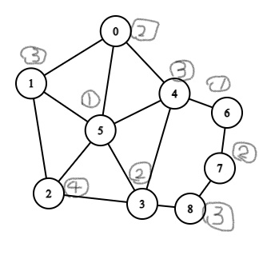

# 以下內容是憑記憶寫出來的，會跟真正的題目有差別，但大部分內容是一樣的，答案是我自己寫的，不一定正確，僅供參考
## 1.有一張圖(忘了長怎樣)
(1). 請證明它是或不是平面圖 答:是 證明:畫出沒有交錯的樣子
(2). 請證明它有或沒有漢米爾頓路徑 答:有 證明:畫出漢米爾頓路徑
## 2.有48個朋友關係在20人之中，請證明是或不是=>存在某些人的朋友數最多4個人?
答:是
證明:48相當於邊，20相當於節點 總degree數 = 2*48 = 96，因此每個人平均有96/20 = 4.8個朋友
反證:如果每個人的朋友數都大於等於5人，那平均朋友數也必大於5，但由於平均是4.8，所以代表一定有人的朋友數是小於等於4人
## 3.一個箱子裡有2個藍球3個紅球，請問抽2個球顏色不同的機率?
答:第一球紅 第二球藍:$\frac{3}{5} * \frac{2}{4}$ ，第一球藍 第二球紅:$\frac{2}{5} * \frac{3}{4}$
顏色不同的機率 = (第一球紅 第二球藍的機率) + (第一球藍 第二球紅的機率)
$$\frac{12}{20} = \frac{6}{20} + \frac{6}{20} = \frac{3}{5}$$
## 4.有3個小孩，男女出生機率相同，求在已有2個女生的情況下3個小孩都為女生的機率
答:$$\frac{3女機率}{3女機率+2女1男機率} = \frac{\frac{1}{2}}{\frac{1}{2}+\frac{1}{2}} = \frac{1}{2}$$
## 5.有八個資料要檢查有沒有病毒，其中5個是有病毒的，只要一檢查到病毒就會發出警告，並停止檢查，請問檢查次數的期望值為何?
答:第一次就檢查到的機率*1+第二次檢查到的機率*2+第三次檢查到的機率*3+第四次檢查到的機率*4 ，只有三個沒病毒所以不可能檢查到五次以上，五次以上的機率為0
$$\frac{5}{8}*1+(\frac{3}{8}*\frac{5}{7})*2+(\frac{3}{8}*\frac{2}{7}*\frac{5}{6})*3+(\frac{3}{8}*\frac{2}{7}*\frac{1}{6}*\frac{5}{5})*4 = \frac{2}{3}$$
## 6.這題數字忘了，用ABC代替，醫院有2區(M區與G區)，M區病患頭痛的比率是A，G區病患頭痛的比率是B，已知病患送進醫院後進入M區的比率為C，進入G區的比率為D
有一個病患有頭痛的症狀，但他忘了他是哪區的，請問他較有可能在哪一區(M or G)?
答:在M區且頭痛的比率 = A * C ，在G區且頭痛的比率 = B * D
因為 在M區且頭痛的比率 > 在G區且頭痛的比率 ，所以該病患較有可能在M區
## 7.計算該圖的著色數
答:4色 證:畫圖，如下

